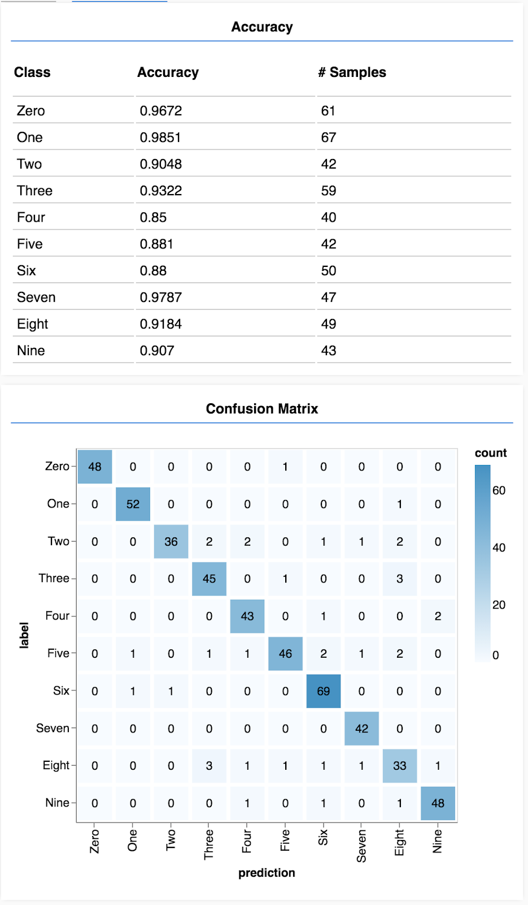

## 相关连接
- [codelabs链接](https://codelabs.developers.google.com/codelabs/tfjs-training-classfication/index.html?hl=zh-cn#0)

## MNIST
是一组手写数字数据集，每个样本都是一张28×28像素的手写数字图片。其中训练集有55000张，测试集有10000张，[MNIST官网链接](http://yann.lecun.com/exdb/mnist/)本demo用的是所有图片合并起来的精灵图，使用时用再进行分割，具体代码再`data.js`。

## 模型结构
1. **卷积层1**：8个边长为5的卷积核，步长为1，独立工作，得到8个特征图。
2. **池化层1**：将8个特征图进行最大池化，窗口为2×2，步长是2×2，得到8个池化后的特征图。
3. **卷积层2**：一共16个边长为5的卷积核，步长为1。对上一层的输出进行卷积，得到16个特征图。
4. **池化层2**：最大池化上一层输出的16个特征图。
5. **展平层**：将数据展平成一维数据，输出给接下来的全连接层继续处理。
6. **全连接层**：用于输出结果，即0到9共10个数字，每个数字的概率。所以`units`为10，使用用于概率分布的激活函数`softmax`。

## 混淆矩阵
可视化分类结果，帮助了解模型是否对某个分类有困惑：